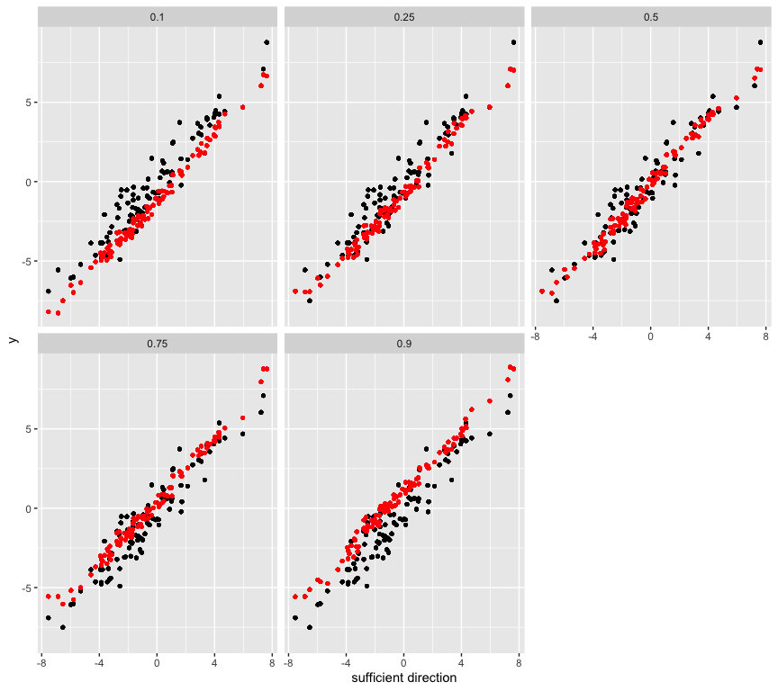

<!-- README.md is generated from README.Rmd. Please edit that file -->

# quantdr

<!-- badges: start -->

<!-- badges: end -->

# quantdr: Dimension Reduction for Conditional Quantiles

The R package ‘quantdr’ performs dimension reduction techniques for
conditional quantiles by estimating the fewest linear combinations of X
that contain all the information on that function. For details of the
methodology, see [Christou, E. (2020) Central quantile subspace.
*Statistics and Computing*, 30,
677–695](https://link.springer.com/article/10.1007/s11222-019-09915-8).

The main function of the package is `cqs`, which estimates the
directions of the central quantile subspace. Once the directions are
determined, one can form the new sufficient predictors and estimate the
conditional quantile function using
`llqr`.

## \#\# Installation

<!--  You can install the released version of quantdr from [CRAN](https://CRAN.R-project.org) with: -->

<!-- ``` r -->

<!-- install.packages("quantdr") -->

<!-- ``` -->

<!-- And the development version from [GitHub](https://github.com/) with: -->

You can install the development version of quantdr from
[GitHub](https://github.com/) with:

``` r
# install.packages("devtools")
devtools::install_github("elianachristou/quantdr")
```

## \#\# Example

This is a basic example which shows you how to solve the problem.

``` r
library(quantdr)

## basic example code - a homogeneous model

# Setting
set.seed(1234)
n <- 100; p <- 10; taus <- c(0.1, 0.25, 0.5, 0.75, 0.9)
x <- matrix(rnorm(n * p), n, p); error <- rnorm(n)
y <- 3 * x[, 1] + x[, 2] + error

# true direction that spans each central quantile subspace
beta_true <- c(3, 1, rep(0, p-2))
beta_true
#>  [1] 3 1 0 0 0 0 0 0 0 0
dir1 <- x %*% beta_true

# Estimate the directions of each central quantile subspace
out <- matrix(0, p, length(taus))
for (i in 1:length(taus)) {
  out[, i] <- cqs(x, y, tau = taus[i], d = 1, dtau = 1)$qvectors
}
out
#>               [,1]         [,2]        [,3]         [,4]          [,5]
#>  [1,]  0.954922925  0.953598024  0.95406239  0.954269775  0.9575634520
#>  [2,]  0.282714019  0.286649942  0.28461138  0.284893586  0.2746101072
#>  [3,]  0.041087139  0.042374854  0.04304897  0.042428540  0.0372367542
#>  [4,]  0.037832725  0.037682669  0.03890855  0.037272969  0.0370684841
#>  [5,] -0.002814562 -0.003387548 -0.00329941 -0.002773467  0.0002099847
#>  [6,] -0.050028660 -0.048834454 -0.04594872 -0.050712960 -0.0501001338
#>  [7,]  0.029258405  0.028428392  0.02829842  0.028574762  0.0356230719
#>  [8,]  0.017428119  0.017728512  0.01855861  0.017255355  0.0157407872
#>  [9,]  0.015474773  0.018001429  0.02187873  0.012898022  0.0099383498
#> [10,]  0.034139000  0.037738606  0.04059751  0.033989205  0.0278435274

# compare the estimated direction with the true one using the angle between the two subspaces
library(pracma)
for (i in 1:length(taus)) {
print(subspace(out[, i], beta_true) / (pi / 2)) # the angle is measured in radians, so divide by pi/2
  }
#> [1] 0.06160559
#> [1] 0.06168634
#> [1] 0.06301522
#> [1] 0.06114523
#> [1] 0.06198434

# Estimate and plot the conditional quantile function using the new sufficient predictors
newx <- x %*% out
par(mfrow=c(2,3))
for (i in 1:length(taus)) {
  plot(dir1, y, xlab = "sufficient direction", ylab = "y", main = taus[i])
  qhat <- llqr(newx[, i], y, tau = taus[i])$ll_est
  points(dir1, qhat, col = "red")
}
```



Another example using the Boston housing data from the `MASS` library in
R.

``` r
library(MASS)
attach(Boston)
# read the data 
y <- medv
x <- cbind(rm, log(tax), ptratio, log(lstat))
data <- cbind(y, x)
n <- length(y); p <- dim(x)[2]

# plot the estimated direction of each predictor variable for multiple quantiles
tau <- seq(0.1, 0.9, by = 0.005)
beta_hat <- matrix(0, p, length(tau))

for (k in 1:length(tau)) {
  out <- cqs(x, y, tau = tau[k])
  beta_hat[, k] <- out$qvectors[, 1:out$dtau] # the estimated dimension of the central subspace is 1
}
   
par(mfrow=c(2,2))
plot(tau, beta_hat[1, ], type = 'l', xlab = 'Quantile', main = 'RM', ylab = 'Coefficient')
plot(tau, beta_hat[2, ], type = 'l', xlab = 'Quantile', main = 'log(TAX)', ylab = 'Coefficient')
plot(tau, beta_hat[3, ], type = 'l', xlab = 'Quantile', main = 'PTRATIO', ylab = 'Coefficient')
plot(tau, beta_hat[4, ], type = 'l', xlab = 'Quantile', main = 'log(LSTAT)', ylab = 'Coefficient')
```


